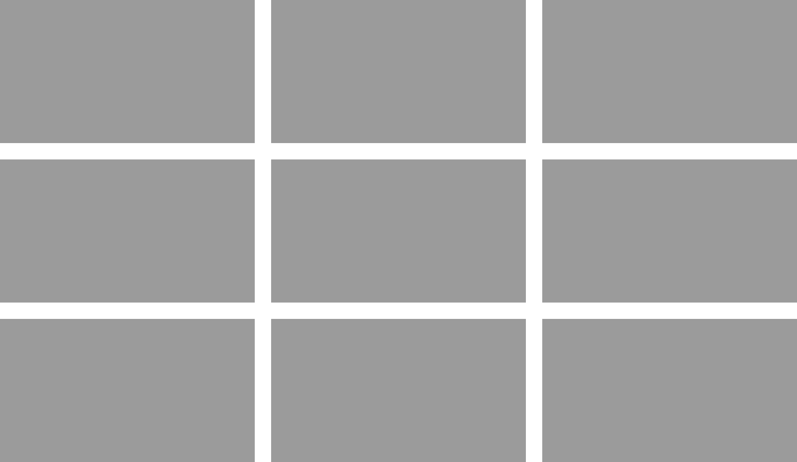
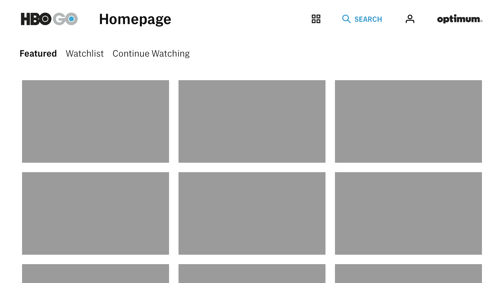
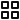

# Artboards

This is an autogenerated file showing all the artboards. Do not edit it directly.

## Artboard

## Copy 1

## Copy 2

## Copy 3

## arrow-right

## ctv-grid-medium

## ctv-home-search-focused

## fpo-clear

## hbo-go-logo

## icon-browse-20x20

## icon-profile-20x20

## icon-search-active-20x20

## icon

## image-16x9

## provider-logo-optimum

